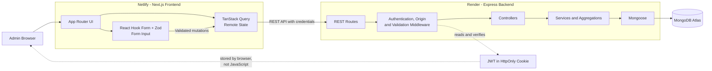

# Doctor Tracker

Doctor Tracker is a secure administrative Doctor and Patient management system. It gives authorized administrators one responsive workspace for managing Doctors and their assigned Patients, with searching, filtering, pagination, session-aware authentication, and meaningful analytics. The project emphasizes frontend quality, query performance, maintainable boundaries, accessible interaction states, and clear data visualization.

## Live Project

| Resource | URL |
| --- | --- |
| Frontend | [https://doctor-tracker.netlify.app](https://doctor-tracker.netlify.app) |
| Backend API | [https://doctor-tracker-api.onrender.com](https://doctor-tracker-api.onrender.com) |
| GitHub repository | [https://github.com/miazi2003/doctor-tracker](https://github.com/miazi2003/doctor-tracker) |
| API health check | [https://doctor-tracker-api.onrender.com/api/health](https://doctor-tracker-api.onrender.com/api/health) |

These are the submission URLs. Complete the manual deployment and end-to-end checks in the [Submission checklist](#submission-checklist) before treating them as verified production evidence.

### Test Admin

Safe public test credentials are not documented in the repository. The repository owner must replace these placeholders with dedicated, non-production test credentials before submission:

```text
Email: <TEST_ADMIN_EMAIL>
Password: <TEST_ADMIN_PASSWORD>
```

Never publish private production credentials or copy values from a real environment file into this README.

## Features

### Authentication

- Secure Admin login with generic invalid-credential responses
- JWT authentication stored in an HttpOnly cookie
- Session restoration through `GET /api/auth/me`
- Protected frontend administration routes and protected backend APIs
- Logout with server-side cookie clearing and client query-cache cleanup
- Explicit loading, error, redirect, and retry states during authentication

### Doctor Management

- Create Doctors with name, specialization, hospital, phone, and email
- Paginated Doctor directory with selectable page size
- Search by name, hospital, specialization, email, or phone
- Exact specialization and hospital filters
- Created-date range filtering
- Doctor details view
- Doctor-specific Patient list
- Add and delete Patients under a specific Doctor

### Patient Management

- Dedicated global Patient directory
- Search by Patient name, phone, condition, or gender
- Doctor, condition, and appointment-date filters
- Pagination and selectable page size
- Add Patient dialog from a Doctor profile
- Edit Patient information
- Delete Patients with confirmation
- Desktop table and mobile card presentations
- Dirty-form confirmation and success notifications

### Dashboard

- Total Doctors and total Patients
- Patients in the selected period
- Average Patients per Doctor
- Patients-per-Doctor bar chart
- Date-based Patient line chart
- Patient-condition donut chart
- Upcoming Patient appointments
- 7, 30, and 90-day range selection

### Security and Performance

- bcrypt password hashing and timing-resistant unknown-account comparison
- Minimal JWT payload with explicit HS256 verification
- HttpOnly, production `Secure`, and environment-aware `SameSite` cookies
- Exact credentialed CORS and unsafe-method Origin protection
- Helmet security headers, request body limits, and login rate limiting
- Zod validation for request data and client-side API responses
- Structured validation errors and sanitized internal failures
- MongoDB indexes aligned with common filtering and sorting patterns
- Explicit projections and Mongoose `lean()` reads
- Concurrent list/count queries and concurrent Dashboard aggregations
- Batched minimal Doctor population in the global Patient response, avoiding frontend N+1 Doctor-detail requests
- TanStack Query caching, targeted invalidation, request cancellation, and previous-data handling

## Technology Stack

| Area | Technologies |
| --- | --- |
| Frontend | Next.js 16 App Router, React 19, TypeScript, Tailwind CSS 4, shadcn/ui, Base UI, TanStack Query, React Hook Form, Zod, Recharts, Lucide React, Sonner |
| Backend | Node.js 24, Express 5, TypeScript, MongoDB, Mongoose, JSON Web Token, bcrypt, Zod, Helmet, express-rate-limit |
| Deployment | Netlify for the frontend, Render for the backend, MongoDB Atlas or another compatible MongoDB deployment for production data |

The application dependencies and supported Node.js runtime are defined in `client/package.json` and `server/package.json`.

## System Architecture



The frontend and backend are independently deployable applications. TanStack Query owns remote frontend state, while React Hook Form and Zod manage form input. Express routes apply security and validation before controllers call services; services contain database queries and aggregations, and Mongoose communicates with MongoDB.

## Data Flow

### Authentication Flow

1. The Admin submits the Login Form.
2. The frontend sends `POST /api/auth/login` with credentials.
3. The backend validates the request with Zod and applies login rate limiting and Origin protection.
4. The authentication service finds the Admin and compares the password with bcrypt.
5. The server signs a minimal JWT and sets it in an HttpOnly cookie.
6. The frontend caches the safe Admin response and opens the protected Dashboard.
7. On reload, `GET /api/auth/me` verifies the cookie, JWT, role, and current Admin record before restoring the UI session.

```text
Login Form
→ POST /api/auth/login
→ Validate credentials
→ bcrypt comparison
→ Signed JWT
→ HttpOnly cookie
→ GET /api/auth/me
→ Authenticated Admin UI
```

### Management Flow

```text
Page or Form
→ TanStack Query/Mutation
→ REST API
→ Authentication Middleware
→ Zod Validation
→ Controller
→ Service
→ Mongoose
→ MongoDB
→ Structured Response
→ Query Cache Update
→ UI Refresh
```

Query parameters hold list filters and pagination state. After successful mutations, the frontend invalidates the affected Doctor, Patient, or Dashboard query families so visible data is refreshed without maintaining a duplicate API-response store.

### Dashboard Flow

The Dashboard requests `GET /api/dashboard/stats?days=7|30|90`. After authentication and query validation, the Dashboard service runs independent Doctor counts, Patient counts, date buckets, Doctor workload groups, condition groups, and upcoming-appointment queries concurrently with `Promise.all`. It zero-fills missing UTC dates and returns one structured response for metric cards, charts, and the upcoming-appointments view.

## Project Structure

```text
Doctor Tracker/
├── client/
│   ├── public/
│   ├── src/
│   │   ├── app/                 # App Router pages and layouts
│   │   ├── components/          # Admin, feature, and shadcn UI components
│   │   ├── features/            # API clients, schemas, and query definitions
│   │   └── lib/                 # Shared API and utility code
│   ├── netlify.toml
│   └── package.json
├── server/
│   ├── src/
│   │   ├── config/
│   │   ├── controllers/
│   │   ├── middleware/
│   │   ├── models/
│   │   ├── routes/
│   │   ├── scripts/
│   │   ├── services/
│   │   ├── utils/
│   │   └── validation/
│   └── package.json
└── README.md
```

## Local Development

### Prerequisites

- Node.js 24.x, matching the backend `engines` declaration
- npm
- Git
- MongoDB Atlas or a local MongoDB instance

### 1. Clone the Repository

```bash
git clone https://github.com/miazi2003/doctor-tracker.git
cd doctor-tracker
```

### 2. Configure and Run the Backend

```bash
cd server
npm install
```

Copy `server/.env.example` to `server/.env` using the command appropriate for your shell, then replace placeholder values locally. Do not commit the resulting file.

PowerShell:

```powershell
Copy-Item .env.example .env
```

Bash:

```bash
cp .env.example .env
```

#### Backend Environment Variables

| Variable | Purpose |
| --- | --- |
| `NODE_ENV` | Runtime mode: development, test, or production |
| `PORT` | HTTP port; defaults to the application's configured local port when omitted |
| `CLIENT_URL` | Exact allowed frontend origin, without a trailing slash |
| `MONGODB_URI` | MongoDB connection string; keep private |
| `JWT_SECRET` | Private JWT signing secret of at least 32 characters |
| `JWT_EXPIRES_IN` | Supported authentication lifetime: `15m`, `1h`, `8h`, `1d`, or `7d` |
| `AUTH_COOKIE_NAME` | Name of the authentication cookie |
| `JSON_BODY_LIMIT` | Maximum accepted JSON request size |
| `LOGIN_RATE_LIMIT_WINDOW_MS` | Login rate-limit window in milliseconds |
| `LOGIN_RATE_LIMIT_MAX` | Maximum login attempts allowed per window |
| `TRUST_PROXY` | Enables one trusted proxy hop when intentionally deployed behind that proxy |
| `ADMIN_NAME` | Initial Admin display name used only by the Admin seed command |
| `ADMIN_EMAIL` | Initial Admin email used only by the Admin seed command |
| `ADMIN_PASSWORD` | Initial Admin password used only by the Admin seed command; never commit it |
| `DEMO_SEED_ENABLED` | Explicit safety gate for optional deterministic demo seeding |

Create the initial Admin only after intentionally configuring the three `ADMIN_*` values:

```bash
npm run seed:admin
npm run dev
```

`seed:admin` is not part of normal application startup. Do not run it against an unintended database.

### 3. Configure and Run the Frontend

Open another terminal from the repository root:

```bash
cd client
npm install
```

Copy `client/.env.example` to `client/.env.local`:

PowerShell:

```powershell
Copy-Item .env.example .env.local
```

Bash:

```bash
cp .env.example .env.local
```

For local development, the public API base URL is:

```env
NEXT_PUBLIC_API_URL=http://localhost:5000
```

Start the frontend:

```bash
npm run dev
```

### Local URLs

| Service | URL |
| --- | --- |
| Frontend | `http://localhost:3000` |
| Backend | `http://localhost:5000` |
| Health check | `http://localhost:5000/api/health` |

### Verification Commands

Run these commands separately inside both `client` and `server`:

```bash
npm run lint
npm run type-check
npm run build
```

The repository does not currently define an automated test script.

## Environment and Secret Handling

- `client/.env.example` and `server/.env.example` are committed templates.
- Real `.env` and `.env.local` files must never be committed.
- Never expose MongoDB credentials, JWT secrets, Admin passwords, cookies, or password hashes in source, logs, screenshots, or documentation.
- The production `CLIENT_URL` must exactly match the frontend origin, and the frontend `NEXT_PUBLIC_API_URL` must point to the deployed API origin.
- Production requires HTTPS for the `Secure`, cross-site authentication cookie.
- Keep `DEMO_SEED_ENABLED=false` in production unless an explicitly controlled one-time seed is intended; restore it immediately afterward.
- Use `TRUST_PROXY=true` only when the application is behind the expected trusted reverse proxy and that proxy behavior has been verified.

## Technical Decisions

### 1. HttpOnly Cookie Authentication Instead of Browser Storage

**Context:** The frontend and backend need persistent Admin authentication without exposing the JWT to application JavaScript.

**Chosen approach:** After successful login, Express signs a minimal JWT containing the Admin ID and role and stores it in an HttpOnly cookie. The frontend restores the session through `/api/auth/me`; it does not read authentication state from `localStorage`, `sessionStorage`, or `document.cookie`.

**Why:** Preventing JavaScript access to the token reduces the chance that an XSS flaw can directly extract reusable authentication credentials. In production, the cookie is also `Secure` and `SameSite=None` to support the separate HTTPS frontend and backend origins.

**Benefits:** Token details stay outside the React application, reloads restore naturally through `/me`, and protected backend routes remain authoritative. Exact credentialed CORS and Origin checks restrict which browser origin can send state-changing requests.

**Trade-offs:** Cross-origin deployment must be exact: HTTPS, `CLIENT_URL`, `NEXT_PUBLIC_API_URL`, CORS credentials, cookie attributes, and proxy settings must agree. The current stateless JWT design also has no individual token revocation list.

### 2. TanStack Query Instead of Duplicating Server State in React Context

**Context:** Doctors, Patients, analytics, and authentication are remote server state with loading, stale, retry, pagination, and invalidation behavior.

**Chosen approach:** Each feature defines stable query-key families and query functions. TanStack Query caches responses, passes cancellation signals to fetch requests, retains previous list data during page/filter transitions, and invalidates related query families after mutations. The current Admin query restores authentication state.

**Why:** A general React Context would still require custom cache lifetime, request deduplication, retry, cancellation, background refresh, and mutation consistency logic.

**Benefits:** Components receive explicit loading, error, updating, and retry states; mutations refresh dependent Doctors, Patients, and Dashboard data without manually synchronizing duplicated stores.

**Trade-offs:** Query-key design and invalidation scope require discipline. This application intentionally uses Context-style providers only to expose the Query Client and shared UI providers, not as an API-response cache.

### 3. Indexed MongoDB Queries and Batched Doctor Resolution

**Context:** Doctor and Patient directories need filtering, pagination, stable ordering, and Doctor information in global Patient rows.

**Chosen approach:** Mongoose models define compound indexes for common exact filters and sort orders. List services use explicit projections, `lean()`, stable sorting with `_id` as a tie-breaker, skip/limit pagination, and concurrent record/count operations. The global Patient query populates only the Doctor ID and name in a batched relationship lookup.

**Why:** Returning minimal plain objects reduces hydration and payload overhead. Including minimal Doctor data in the global Patient response prevents the frontend from making one Doctor-detail request per Patient.

**Benefits:** Common filters align with compound indexes, ordering is deterministic when dates are equal, count and record queries do not wait on one another, and the UI receives display-ready relationship data.

**Trade-offs:** Contains-regex search is not fully accelerated by ordinary MongoDB B-tree indexes, and skip-based pagination becomes less efficient at very large offsets. Larger deployments may require normalized prefix search, Atlas Search, and cursor pagination.

### 4. Separate Next.js Frontend and Express REST API

**Context:** The assignment requires a frontend-focused interface backed by a standalone Node.js API and MongoDB.

**Chosen approach:** The repository contains independently runnable and deployable `client` and `server` applications connected through a typed REST contract.

**Why:** This separation keeps UI concerns, remote-state management, HTTP validation, business queries, and persistence in clear layers. It also permits another client to reuse the API without coupling it to Next.js rendering.

**Benefits:** Frontend and backend builds scale and deploy independently; routes, controllers, services, and models remain testable boundaries; and deployment ownership is explicit.

**Trade-offs:** Separate origins make CORS, Origin validation, cross-site cookie behavior, environment variables, HTTPS, and proxy configuration critical parts of production correctness.

## API Overview

| Method | Endpoint | Authentication | Purpose |
| --- | --- | --- | --- |
| `GET` | `/` | Public | Basic API status response |
| `GET` | `/api/health` | Public | Health check |
| `POST` | `/api/auth/login` | Public, rate-limited and Origin-protected | Validate Admin credentials and set the authentication cookie |
| `POST` | `/api/auth/logout` | Origin-protected | Clear the authentication cookie |
| `GET` | `/api/auth/me` | Required | Return the current safe Admin identity |
| `GET` | `/api/dashboard/stats` | Required | Return Dashboard counts, aggregations, and upcoming Patients |
| `POST` | `/api/doctors` | Required | Create a Doctor |
| `GET` | `/api/doctors` | Required | List, search, filter, and paginate Doctors |
| `GET` | `/api/doctors/:doctorId` | Required | Return Doctor details |
| `POST` | `/api/doctors/:doctorId/patients` | Required | Add a Patient under a Doctor |
| `GET` | `/api/doctors/:doctorId/patients` | Required | List a Doctor's Patients |
| `GET` | `/api/patients` | Required | List, search, filter, and paginate all Patients |
| `GET` | `/api/patients/:patientId` | Required | Return a Patient with Doctor details |
| `PATCH` | `/api/patients/:patientId` | Required | Update editable Patient information |
| `DELETE` | `/api/patients/:patientId` | Required | Delete a Patient |

## Visual Evidence

No real screenshots are currently committed. Capture the following views with sanitized demo data before submission. The intended Markdown references are retained in HTML comments so this README does not display broken images.

### Desktop Screenshots

- [ ] `docs/screenshots/desktop/login.png`
- [ ] `docs/screenshots/desktop/dashboard.png`
- [ ] `docs/screenshots/desktop/doctors.png`
- [ ] `docs/screenshots/desktop/doctor-details.png`
- [ ] `docs/screenshots/desktop/patients.png`

<!--


-->

### Mobile Screenshots

- [ ] `docs/screenshots/mobile/login.png`
- [ ] `docs/screenshots/mobile/dashboard.png`
- [ ] `docs/screenshots/mobile/doctor-list.png`
- [ ] `docs/screenshots/mobile/patient-list.png`
- [ ] `docs/screenshots/mobile/navigation.png`

<!--


-->

## Deployment Notes

### Frontend — Netlify

- Base directory: `client`
- Build command: `npm run build`
- Publish directory: `.next`
- Runtime integration: `@netlify/plugin-nextjs`, configured in `client/netlify.toml`
- Production environment variable:

```env
NEXT_PUBLIC_API_URL=https://doctor-tracker-api.onrender.com
```

The repository configuration uses Netlify's Next.js plugin/runtime integration. Configure the base directory in the Netlify project so its build runs relative to `client`.

### Backend — Render

- Root directory: `server`
- Build command: `npm ci && npm run build`
- Start command: `npm start`
- Health-check path: `/api/health`
- Runtime: Node.js 24.x as declared by `server/package.json`
- `PORT`: supplied by Render and parsed by the application

Configure every production environment variable securely in Render. At minimum, ensure the database URI, signing secret, exact Netlify `CLIENT_URL`, cookie settings, and trusted-proxy choice are correct. The repository does not currently include a Render Blueprint file, so these dashboard settings require manual configuration and verification.

## Known Limitations and Scaling Path

- Contains-regex search is flexible but is not fully optimized by ordinary MongoDB B-tree indexes. Atlas Search or normalized prefix-search fields would scale better.
- Skip-based pagination is simple and stable for moderate datasets but becomes less efficient at very large offsets; cursor pagination is the natural next step.
- Some Dashboard groups operate across the Patient population. High-volume deployments may need cached or materialized analytics.
- Stateless JWT sessions cannot currently be individually revoked before expiration.
- Only one exact frontend origin is configured, so preview URLs require deliberate environment handling.
- No automated unit, API integration, browser, or end-to-end test suite is currently configured.
- Production environment behavior, cookie delivery, accessibility, real-device responsiveness, and complete CRUD flows still require manual verification.

These are future scalability and verification improvements, not hidden claims about completed production testing.

## Submission Checklist

Repository evidence supports only the checked items below. Deployment and manual QA items remain unchecked until they are explicitly verified.

- [ ] Frontend deployment URL opened and verified
- [ ] Backend deployment and `/api/health` opened and verified
- [ ] Production MongoDB connection verified
- [ ] Dedicated Test Admin credentials added to this README
- [ ] Desktop screenshots captured and added
- [ ] Mobile screenshots captured and added
- [x] Committed environment-example variable names verified against source
- [ ] All README public links opened and verified
- [ ] Production login, session restoration, and logout tested
- [ ] Doctor and Patient CRUD flows tested in production
- [ ] Dashboard data and range selection tested in production
- [ ] Mobile responsiveness tested on real devices or browser device emulation
- [x] Real environment files and common secret files are excluded by `.gitignore`
- [x] Client lint, strict type-check, and production build pass locally
- [x] Server lint, strict type-check, and production build pass locally

## License

No license file is currently included. Unless the repository owner adds a license, all rights remain with the copyright holder.
